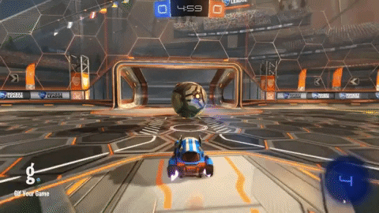
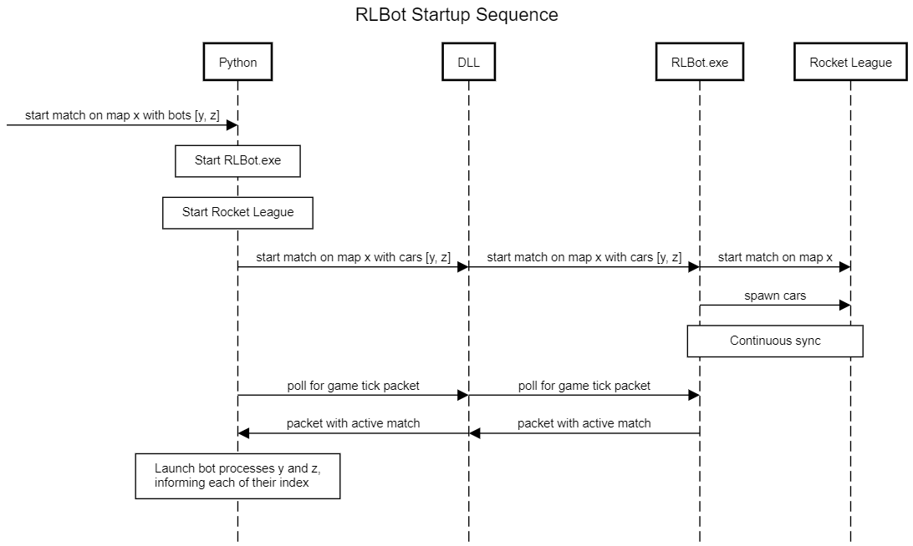

# RocketLeagueBotIndependentStudy

This project was done as an independent study. It is a bot program that is able to play the game Rocket League. It was created by me, Harrison Paxton, as a software engineering senior at FGCU. I made it during the Spring 2020 semester. At this point I was fairly knowledgeable of Java but this was my first video game programming experience. While it was done for an independent study, the idea was one I came up with being a fan of the video game Rocket League and seeing other people create bots. It was something I had been wanting to do and I was very excited when my independent study application was approved. This is my last semester of software engineering at FGCU although next year I will be staying and taking a few graduate classes as well as finishing up an entrepreneurship minor. The plan is to graduate in Spring 2021.

## Demonstration
 

## Documentation

[Docs](https://github.com/harrisonp18/RocketLeagueBotIndependentStudy/tree/master/docs)

## Diagrams

## Getting Started

1.Make sure you've installed Python 3.6.5 or newer. Here's Python 3.7 64 bit. Some older versions like 3.6.0 will not work.

   During installation:
   
    *Select "Add Python to PATH"
    
    *Make sure pip is included in the installation
    
2.Make sure you've installed the Java 8 JDK or newer. Here's the Java 8 JDK.

3.Make sure you've set the JAVA_HOME environment variable.

4.Download this repository

5.Double click on run-bot.bat and leave it running. It's supposed to stay open and it's OK if it says something like "75%".

6.Double click on run-gui.bat

7.Click the 'Run' button

   *Bot behavior is controlled by src/main/java/rlbotexample/SampleBot.java
  
   *Bot appearance is controlled by src/main/python/javaExampleAppearance.cfg

## Built With

*IntelliJ Idea Ultimate

*Java

*RLBot

## Contributing

Contribute to this project by making your own bot!

## Author

Harrison Paxton

## License

This project is licensed under the MIT License.

## Acknowledgments

*RLBot.org

*Professor VanSelow

## History

This project was started in the Spring 2020 semester. Any additions or changes following the semester will be noted here.

## Key Programming Concepts Utilized

How you solved a complex engineering problem by applying principles of engineering, science, and mathematics.

This project presented me with the problem of creating a bot that could play the game rocket league. The biggest factor in solving this problem was understanding how the code worked and how the provided RLBot framework interacted with the game through the Psyonix API. This was done by looking at framework provided and figuring out how the code worked to being with. From there is was a matter of deciding what I wanted the bot to be able to do and figuring out how to do it. This included using the RLBot website and the resources it provided such as the wiki, as well as talking to other developers through things such as Discord. I feel that in fields such as engineering, science, and math commuication with others as well as the ability to do independent research are paramount to solving issues and I think I successfully did both of those things in this project.

A description of how it meets specified needs with consideration of public health, safety, and welfare, as well as global, cultural, social, environmental, and economic factors.

Due to the fact that this program is simply a bot program for personal use within a video game, there arent too many issues in many of the contexts mentioned in this prompt. That being said, the goal and objective of the project was achieved and no issues in any of those regards occured. The project is based off of open source code and was done as a learning experience for a topic in which I had a personal interest.
